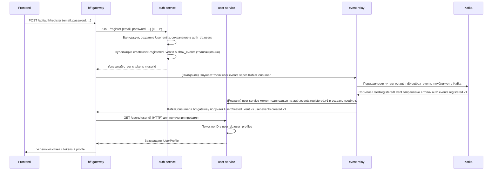
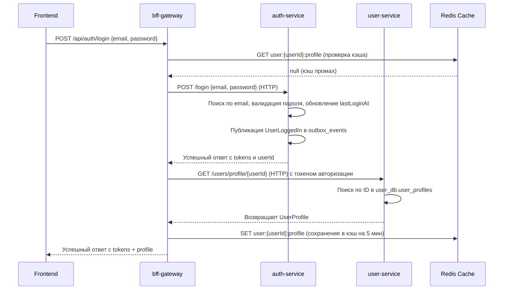
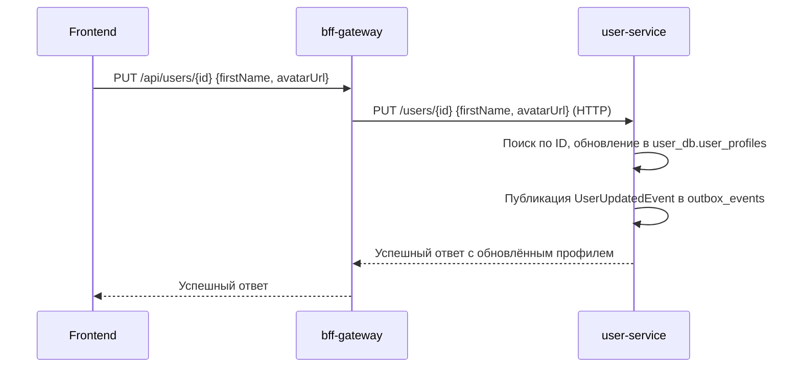

```markdown
# 📚 Глубокий анализ архитектуры и взаимодействий сервисов

Этот документ представляет собой детальный технический анализ платформы, основанный на структуре кода, конфигурациях и логике взаимодействия. Он раскрывает не только *что* делает каждый сервис, но и *как*, *почему* и *в какой последовательности* происходит обмен данными между ними.

---

## 🔍 Общая архитектурная модель

Платформа построена по принципу **событийно-ориентированной архитектуры (Event-Driven Architecture, EDA)** с использованием паттерна **Outbox** для обеспечения надежности и согласованности данных. Ключевая идея: **никакие два сервиса не должны напрямую модифицировать данные друг друга**. Вместо этого они публикуют события о произошедших изменениях, а другие сервисы реагируют на эти события асинхронно.

### Основные компоненты взаимодействия

| Компонент | Роль | Технология | Ответственность |
|-----------|------|------------|----------------|
| **`auth-service`** | Источник событий регистрации и входа | NestJS + PostgreSQL | Создаёт `UserRegisteredEvent`, `UserLoggedIn`, `UserLoginFailed`. Не создаёт профиль пользователя в своей БД — только учётную запись. |
| **`user-service`** | Источник событий профиля | NestJS + PostgreSQL | Создаёт `UserCreatedEvent` после сохранения профиля. Реагирует на `UserRegisteredEvent` из `auth-service` (опционально). |
| **`event-relay`** | Мост между БД и Kafka | Node.js + TypeORM + KafkaJS | Периодически опрашивает таблицы `outbox_events` в `auth_db` и `user_db`, публикует их содержимое в Kafka. |
| **`bff-gateway`** | Агрегатор и потребитель событий | Express + KafkaJS | Подписывается на топики Kafka (`user.events`) и ожидает `UserCreatedEvent`/`UserRegisteredEvent` для завершения процесса регистрации. |
| **Kafka Cluster** | Централизованный брокер событий | Confluent Kafka | Единый канал доставки событий между всеми сервисами. |

---

## 🔄 Детализированные потоки взаимодействия

### 1. Поток регистрации нового пользователя (`/api/auth/register`)

Это самый сложный и критичный поток, демонстрирующий полную цепочку от HTTP-запроса до финального состояния.



**Ключевые особенности:**
- **Асинхронность**: `bff-gateway` не ждёт создания профиля синхронно. Он отправляет запрос в `auth-service`, получает токены, а затем *асинхронно* ожидает событие о создании профиля.
- **Надёжность**: Если `user-service` временно недоступен, `event-relay` будет повторять попытки публикации события до тех пор, пока оно не будет успешно обработано или не попадёт в DLQ (Dead Letter Queue).
- **Согласованность**: Профиль создаётся *после* успешной регистрации в `auth-service`, что гарантирует, что пользователь существует в системе.

---

### 2. Поток входа пользователя (`/api/auth/login`)

Более простой, но также важный поток, демонстрирующий работу с кэшированием.



**Ключевые особенности:**
- **Кэширование**: `bff-gateway` использует Redis для кэширования профилей, что значительно снижает нагрузку на `user-service`.
- **Интеграция токенов**: `auth-service` генерирует JWT, которые затем используются `bff-gateway` для аутентификации при вызовах `user-service`.

---

### 3. Поток обновления профиля (`/api/users/{id}`)

Пример синхронного взаимодействия без участия событий.



**Ключевые особенности:**
- **Прямая маршрутизация**: `bff-gateway` выступает как прокси, перенаправляя запросы напрямую в `user-service`.
- **События для реактивности**: Хотя сам запрос синхронный, `user-service` всё равно публикует `UserUpdatedEvent`, чтобы другие сервисы (например, сервис уведомлений или аналитики) могли на него отреагировать.

---

## 🧩 Детальный анализ каждого сервиса

### `auth-service` — Сервис идентификации и авторизации

- **Ядро**: Управление жизненным циклом учётной записи: регистрация, вход, выход, восстановление пароля, 2FA.
- **Хранилище**: PostgreSQL (`auth_db`). Содержит таблицы `users`, `refresh_tokens`, `two_factor_secrets`.
- **События**: Публикует `UserRegisteredEvent`, `UserLoggedIn`, `UserLoginFailed`. Эти события пишутся в свою собственную таблицу `outbox_events`.
- **Важно**: Не хранит профиль пользователя (имя, аватар, телефон). Это ответственность `user-service`.

### `user-service` — Сервис управления профилем

- **Ядро**: Управление данными профиля: создание, чтение, обновление, удаление, поиск.
- **Хранилище**: PostgreSQL (`user_db`). Содержит таблицы `user_profiles`, `user_preferences`, `user_statistics`.
- **События**: Публикует `UserCreatedEvent`, `UserUpdatedEvent`, `UserDeletedEvent`. Также может *подписываться* на события из `auth-service`, например, для автоматического создания профиля при регистрации.
- **Важно**: Полностью независим от `auth-service` в плане БД. Единственная связь — через HTTP API и Kafka.

### `bff-gateway` — Backend-for-Frontend

- **Ядро**: Агрегация данных для frontend. Объединяет данные из `auth-service` и `user-service` в единый ответ.
- **Хранилище**: Redis для кэширования профилей и токенов.
- **События**: **Потребитель**, а не издатель. Использует `KafkaEventWaiter` для ожидания событий `UserCreatedEvent`/`UserRegisteredEvent`, чтобы "дождаться" завершения асинхронного процесса регистрации.
- **Важно**: Это единственный сервис, который имеет двойную роль: он и агрегатор, и потребитель событий. Он "закрывает" асинхронный разрыв между регистрацией и созданием профиля для frontend.

### `event-relay` — Событийный ретранслятор

- **Ядро**: Механизм гарантированной доставки событий. Это "мост" между реляционными базами данных и Kafka.
- **Хранилище**: Нет собственного хранилища. Читает из `outbox_events` в `auth_db` и `user_db`.
- **События**: **Издатель**. Читает строки из таблиц `outbox_events` и публикует их в соответствующие Kafka-топики.
- **Важно**: Реализует паттерн Outbox, который решает проблему "двухфазной фиксации" (2PC) в распределённых системах. Событие записывается в БД в той же транзакции, что и бизнес-операция, что гарантирует его наличие.

---

## 🛡️ Механизмы отказоустойчивости и наблюдаемости

| Механизм | Где реализован | Как работает |
|----------|----------------|----------------|
| **Circuit Breaker** | `event-relay/src/infrastructure/messaging/CircuitBreaker.ts` | Защищает `KafkaProducerService` от постоянных сбоев при публикации. При превышении порога ошибок переходит в состояние `OPEN`, блокируя все вызовы на время. Затем переходит в `HALF_OPEN` для проверки работоспособности. |
| **DLQ (Dead Letter Queue)** | `event-relay/src/infrastructure/messaging/KafkaProducerService.ts` | Если событие не может быть обработано после `MAX_ATTEMPTS` (по умолчанию 3), оно отправляется в специальный топик `*.dlq.v1` для последующего анализа и ручной обработки. |
| **Health Checks** | Все сервисы (`/health`) | Каждый сервис предоставляет эндпоинт `/health`, который проверяет состояние своих зависимостей (БД, Kafka, Redis). Docker Compose использует эти эндпоинты для `healthcheck`. |
| **Prometheus Metrics** | Все сервисы | Экспортируют метрики (latency, error rate, request count) на порт `9091`/`9092`. Prometheus собирает их, Grafana строит дашборды. |
| **Structured Logging** | Все сервисы | Логи форматируются в JSON, что позволяет легко интегрировать их с ELK-стеком или Loki. |

---

## 📌 Заключение: Архитектурные преимущества

Эта платформа демонстрирует зрелый подход к построению микросервисов:

1. **Чёткое разделение ответственности**: Каждый сервис решает одну задачу и не вторгается в зону ответственности других.
2. **Гарантированная доставка событий**: Паттерн Outbox + `event-relay` обеспечивает надёжность даже при временных сбоях Kafka или целевых сервисов.
3. **Масштабируемость**: Все сервисы независимы и могут масштабироваться отдельно. Kafka служит буфером, сглаживающим пики нагрузки.
4. **Устойчивость к сбоям**: Circuit Breaker, DLQ и health checks позволяют системе продолжать работать в частичном отказе.
5. **Наблюдаемость "из коробки"**: Интеграция с Prometheus/Grafana и Kafka UI даёт полную видимость состояния всей системы.

Это не просто набор сервисов, а продуманная, согласованная и готовая к эксплуатации платформа.
